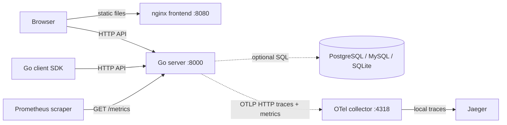

# Architecture

This document explains the template's module boundaries, request flow, dependencies,
and deployment topology. Read it before changing or reviewing the implementation.

**Keep this document updated:** changes to module responsibilities, ports, protocols,
dependencies, request or startup/shutdown flows, or deployment topology must update
this file in the same PR. Reviewers should flag architecture changes that leave this
document outdated.

For development rules and commands, see [AGENTS.md](../AGENTS.md). For deriving a
new project from the template, see [SKILL.md](../SKILL.md).

## System overview

The template contains one Go HTTP server, a public Go client SDK, and an independent
Next.js static frontend. [spec/openapi.yaml](../spec/openapi.yaml) defines the API
contract shared by the server and both client languages.



The database and telemetry exporters are optional. The server always exposes
`/metrics`. The local collector and Jaeger run through Docker Compose; Prometheus
is shown as a possible scraper and is not included in that stack. The Go server
does not serve frontend assets.

## Module boundaries

| Location | Responsibility |
|---|---|
| [cmd/server](../cmd/server/) | Load configuration, initialize dependencies, wire HTTP routes, and coordinate shutdown. |
| [cmd/migrate](../cmd/migrate/) | Run embedded SQL migrations without starting the HTTP server. |
| [spec](../spec/) | Own the OpenAPI contract and Go generator configurations. |
| [internal/api](../internal/api/) | Generated server models, Gin bindings, and `StrictServerInterface`. |
| [internal/handler](../internal/handler/) | Adapt service results and domain errors to generated HTTP response types and public error codes. |
| [internal/service](../internal/service/) | Execute business operations and readiness checks over injected dependencies. |
| [internal/middleware](../internal/middleware/) | Own the global middleware chain and common HTTP error handling. |
| [internal/db](../internal/db/) | Initialize Gorm, manage connections, and execute embedded migrations; `models/` and `store/` contain persistence examples. |
| [internal/config](../internal/config/) | Merge YAML over defaults and validate server configuration. |
| [internal/oas](../internal/oas/) | Validate API versioning and operation deprecation policies at startup. |
| [internal/logging](../internal/logging/), [internal/otel](../internal/otel/), [internal/version](../internal/version/) | Provide structured logging, telemetry providers, and build metadata. |
| [pkg/api](../pkg/api/) | Provide generated public Go models, the client SDK, and the embedded OpenAPI document. |
| [pkg/httpx](../pkg/httpx/) | Provide reusable outbound HTTP helpers with retries, tracing, and logging. |
| [web](../web/) | Build the React UI and typed browser client as a static export. |
| [chart](../chart/) | Deploy separate backend and frontend workloads and services with Helm. |

Services return domain values and errors; handlers own their mapping to HTTP and
[internal/errcode](../internal/errcode/). Middleware handles transport failures
without importing handlers. Persistent models are distinct from generated API
models. The included greeting operation does not use the database or example store.

## Contract and code generation

All API types and route bindings originate in `spec/openapi.yaml`:

| Command | Outputs | Consumers |
|---|---|---|
| `make gen` | `internal/api/types.gen.go`, `internal/api/spec.gen.go` | Server models, route bindings, and strict handler interface. |
| `make gen` | `pkg/api/types.gen.go`, `pkg/api/client.gen.go` | Public Go client SDK. |
| `make gen` | `pkg/api/spec.gen.go` | Embedded contract used for server request validation and runtime introspection. |
| `make gen-web` | `web/src/api/schema.gen.ts` | TypeScript API types used by the browser client. |

[scripts/gen.sh](../scripts/gen.sh) runs the Go generator from the isolated
[tools](../tools/) module. The public client has its own generated model copy
because it cannot expose types from the server's `internal/` package. Generated
files are committed; edit the spec and run `make gen-all` to update both languages.

[web/src/api/client.ts](../web/src/api/client.ts) is the hand-written runtime
client built with `openapi-fetch`; TypeScript generation produces types only.
The embedded spec is consumed by the server, but there is no `/openapi.json` route.

Business routes use a `/vN/` prefix. `/healthz`, `/readyz`, and `/version` are the
unversioned contract exceptions. `internal/oas` validates that policy and deprecated
operations' dates at startup. CI checks spec validity, generated-file drift, and
breaking changes against the PR target branch's spec.

## Request flow

[cmd/server/main.go](../cmd/server/main.go) wires
`service.New(gdb)` into `handler.New(svc)`, then registers the generated strict
handler with common error options. API requests follow this chain:

```text
HTTP listener
  -> Recovery -> OTel -> Logging -> CORS -> Body limit
  -> Embedded OpenAPI request validator
  -> Generated Gin binding and strict handler
  -> internal/handler -> internal/service
  -> Typed response serialization
```

OTel runs before logging so log records can carry the active trace and span IDs.
CORS allows every origin without credentials. HTTP timeouts and request header/body
limits are code-owned constants in `cmd/server/main.go`.

Business failures are mapped by handlers. Parsing, validation, routing,
serialization, and panic failures use the common `api.Error` response through
middleware; internal details remain in server logs.

| Endpoint | Responsibility |
|---|---|
| `GET /healthz` | Report process liveness without checking dependencies. |
| `GET /readyz` | Ping the configured database; return 200 when DB is disabled and 503 when a configured DB is unavailable. |
| `GET /version` | Report build metadata, using `dev` / `unknown` for fields omitted at build time. |
| `POST /v1/greetings` | Demonstrate contract validation, a service operation, and typed response/error mapping. |
| `GET /metrics` | Serve the default Prometheus registry through the global middleware chain, outside the OAS validator. |

`/metrics` is operational and intentionally absent from the spec and generated
clients. Logging records the first successful request and every error for metrics
and health probes, suppressing repeated successful accesses.

## Startup, persistence, and shutdown

Startup loads defaults plus the YAML file selected by `-c` (default `config.yaml`),
validates configuration, initializes slog and OTel, then initializes the database.
There is no application environment-variable overlay. A missing config file uses
defaults; other load or validation failures stop startup.

An empty `db.driver` disables persistence and injects a nil `*gorm.DB` into the
service. A configured driver opens PostgreSQL, MySQL, or SQLite, registers SQL
tracing, configures the pool, and pings before applying embedded migrations. The
HTTP listener starts only after dependency initialization succeeds.

Database configuration uses separate `host`, `port`, `user`, `password`, and
`database` fields. The DB package builds the driver's connection string internally
for both server startup and manual migrations. PostgreSQL also accepts `ssl_mode`.
For SQLite, `database` is a file path or `:memory:`; network and credential fields
are unused. Configuration validation supplies the default network port and checks
required fields; raw `db.dsn` configuration is no longer supported.

[internal/db/migrations](../internal/db/migrations/) contains timestamped
`.up.sql` / `.down.sql` pairs executed by `golang-migrate`. Applied versions and
dirty state live in `schema_migrations`. Applied migrations are immutable; the
initial migration directory is empty. `make migrate-up` and `make migrate-down`
run the same embedded migrations through `cmd/migrate`, using YAML selected by
`CONFIG`. No automatic Gorm schema migration creates the example model's table.

On SIGINT or SIGTERM, the HTTP server closes listeners and waits for in-flight
requests with a ten-second shutdown deadline. There is no separate readiness drain
state or delay. Cleanup then closes the DB and flushes OTel with a bounded timeout.

## Telemetry and deployment

When enabled, OTel exports traces and metrics through OTLP HTTP and also registers
an OTel Prometheus exporter in the default registry. With OTel disabled, `/metrics`
still serves Go runtime and process collectors.

[docker-compose.yml](../docker-compose.yml) starts only the local observability
stack: an OTel collector and Jaeger. Its [collector configuration](../build/otelcol/config.yaml)
forwards traces to Jaeger and writes metrics to the debug exporter. It does not
start the backend, frontend, database, or a Prometheus scraper.

The backend image runs on `:8000`. The frontend builds with Next.js static export
and serves `web/out` through nginx on `:8080`, with no Next.js runtime server.
`NEXT_PUBLIC_API_BASE_URL` is baked into the frontend at build time; changing the
running nginx container's environment does not change that URL.

The Helm chart creates separate backend and optional frontend Deployments and
Services. Backend configuration is mounted as YAML from a ConfigMap or an existing
Secret. The chart does not deploy a database or collector; its default configuration
disables both DB and OTel. Backend probes use `/healthz` and `/readyz`, and the
termination grace period must exceed the HTTP shutdown deadline. Optional Ingress
and server HPA are configured through [chart/values.yaml](../chart/values.yaml).
For a backend path prefix such as `/api`, configure ingress-controller rewriting
and the frontend base URL to preserve the API paths defined by the spec.
